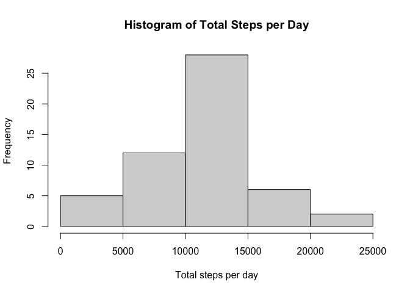
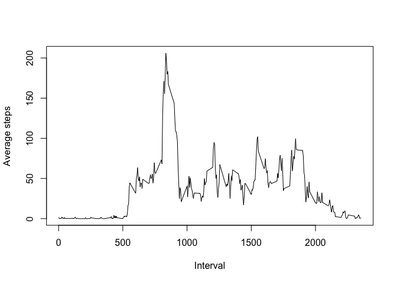
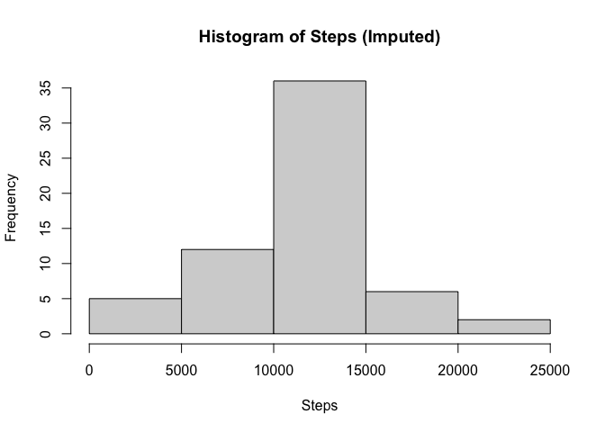
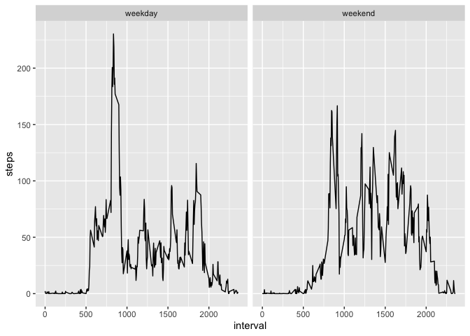

## Loading and preprocessing the data

``` r
library(dplyr)
```

```
## 
## Attaching package: 'dplyr'
```

```
## The following objects are masked from 'package:stats':
## 
##     filter, lag
```

```
## The following objects are masked from 'package:base':
## 
##     intersect, setdiff, setequal, union
```

``` r
library(ggplot2)
library(lubridate)
```

```
## 
## Attaching package: 'lubridate'
```

```
## The following objects are masked from 'package:base':
## 
##     date, intersect, setdiff, union
```

``` r
activity <- read.csv("activity.csv", stringsAsFactors = FALSE)
activity$date <- as.Date(activity$date)
```

## What is mean total number of steps taken per day?

``` r
daily_steps <- aggregate(steps ~ date, activity, sum, na.rm = TRUE)

hist(daily_steps$steps,
main = "Histogram of Total Steps per Day",
xlab = "Total steps per day")
```

<!-- -->

``` r
mean(daily_steps$steps)
```

```
## [1] 10766.19
```

``` r
median(daily_steps$steps)
```

```
## [1] 10765
```

## What is the average daily activity pattern?

``` r
interval_avg <- aggregate(steps ~ interval, activity, mean, na.rm = TRUE)

plot(interval_avg$interval, interval_avg$steps,
type="l",
xlab="Interval",
ylab="Average steps")
```

<!-- -->

``` r
interval_avg$interval[which.max(interval_avg$steps)]
```

```
## [1] 835
```

## Imputing missing values

``` r
sum(is.na(activity$steps))
```

```
## [1] 2304
```

``` r
activity2 <- activity
na <- is.na(activity2$steps)
activity2$steps[na] <- interval_avg$steps[match(activity2$interval[na], interval_avg$interval)]

daily2 <- aggregate(steps ~ date, activity2, sum)
hist(daily2$steps,
main="Histogram of Steps (Imputed)",
xlab="Steps")
```

<!-- -->

``` r
mean(daily2$steps)
```

```
## [1] 10766.19
```

``` r
median(daily2$steps)
```

```
## [1] 10766.19
```

## Are there differences in activity patterns between weekdays and weekends?

``` r
activity2$day <- ifelse(weekdays(activity2$date) %in% c("Saturday","Sunday"),
"weekend","weekday")

by_interval <- aggregate(steps ~ interval + day, activity2, mean)

library(ggplot2)
ggplot(by_interval, aes(interval, steps)) +
geom_line() +
facet_wrap(~day)
```

<!-- -->
